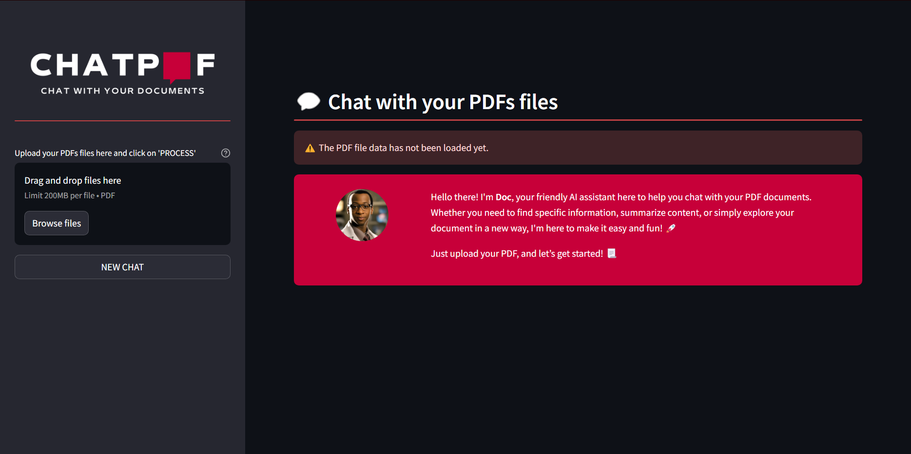
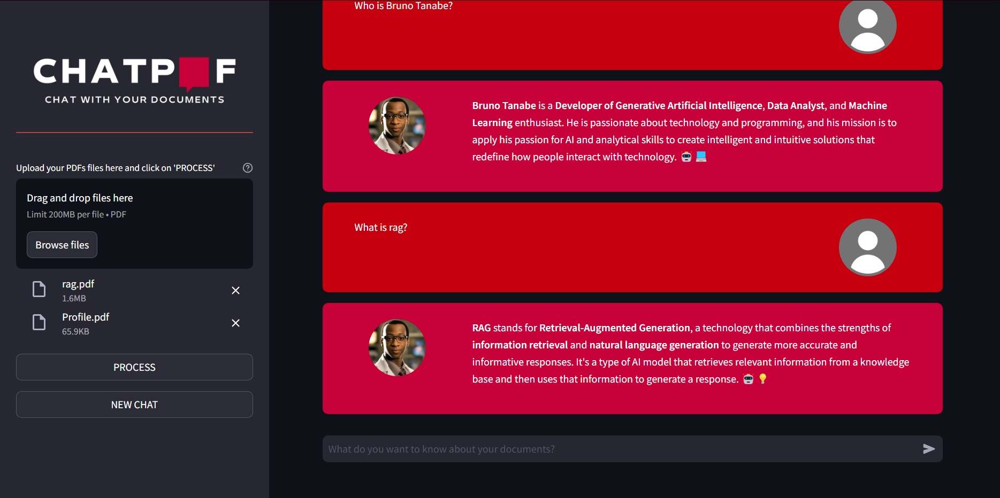

# 🗓️ ChatPDF AI Powered Document Interaction

🎉 Welcome to **ChatPDF AI Powered Document Interaction**! This system is designed to allow users to interact with their PDF documents intuitively and efficiently. Using retrieval-augmented generation (RAG) technology, ChatPDF facilitates querying PDF content, extracting information, summarizing texts, and enhancing document accessibility. Just upload a PDF and start conversing with it using natural language, making information extraction and management easier and faster.





## 📑 Table of Contents

- [Project Description](#-chatpdf-ai-powered-document-interaction)
- [Project Objectives](#-project-objectives)
- [Key Features](#-key-features)
- [Technologies Used](#-technologies-used️)
- [Project Structure](#-project-structure)
- [Running the Project](#-running-the-project)
- [Future Features](#-future-features)
- [License](#-license)
- [How to Contribute](#-how-to-contribute)
- [Author and Contact](#-author-and-contact)

## 🎯 Project Objectives

The main goal of ChatPDF AI Powered Document Interaction is to simplify and optimize interaction with PDF documents, ensuring a personalized and efficient experience. It aims to:

- Facilitate querying the content of user-uploaded PDFs.
- Simplify the extraction and summarization of document information.
- Provide a user-friendly interface to improve the accessibility and usability of PDFs.

## 🔍 Key Features

- **PDF Interaction:** ChatPDF guides the user in querying and interacting with PDF document content.
- **Dynamic Data Querying:** Uses RAG to provide accurate and contextual answers based on PDF content.
- **User-Friendly Interface:** Designed for a smooth and accessible user experience, making navigation and feature use easy.

## 🛠️ Technologies Used

- **Python:** Main programming language.
- **LangChain:** For conversational logic and natural language processing.
- **Hugging Face Embeddings and FAISS:** For efficient information storage and retrieval.
- **Streamlit:** For creating the user interface.
- **Groq API and Llama3-70b-8192:** For high-performance processing and large-scale language modeling.
- **LangSmith (Optional):** To track and evaluate conversation quality.

## 📁 Project Structure

The project is organized as follows:

- `.streamlit/`: Contains Streamlit configuration files.
- `config/`: Contains configuration files, such as environment variables.
- `data/`: Data and storage files.
- `docs/`: Relevant documentation and user guides.
- `notebooks/`: Jupyter Notebook files for analysis and experiments.
- `prints/`: Application screenshots.
- `scripts/`: Auxiliary scripts for specific tasks.
- `src/`: Application source code.
- `venv/`: Python virtual environment.
- `.gitignore`: Git configuration file.
- `LICENSE`: Project license.
- `README_ptbr.md`: README in Portuguese.
- `README.md`: README in English.
- `requirements.txt`: Project dependencies list.
- `setup.bat`: Script to install dependencies and run the chatbot on Windows.
- `setup.sh`: Script to install dependencies and run the chatbot on Linux.

```
chatpdf-ai-powered-document-interaction/
├── .streamlit/
├── config/
│   ├── .env
│   └── .env.example
├── docs/
│   ├── commits_pattern_ptbr.md
│   └── commits_pattern.md
├── notebooks/
│   └── dependecies_list.ipynb
├── prints/
│   ├── chatbot_1.png
│   └── chatbot_2.png
├── src/
│   ├── assets/
│   │   ├── favicon.ico
│   │   └── vertical_logo.png
│   ├── static/
│   │   ├── ai_profile_photo.png
│   │   └── human_profile_photo.png
│   ├── app.py
│   ├── functions.py
│   ├── html_templates.py
│   └── models.py
├── venv/
├── .gitignore
├── LICENSE
├── README_ptbr.md
├── README.md
├── requirements.txt
├── setup.bat
└── setup.sh
```

## 🚀 Running the Project

### On Linux (Method 1):
To run the chatbot locally, follow the steps below:
1. Clone the repository:
   ```
   git clone https://github.com/BrunoTanabe/chatpdf-ai-powered-document-interaction.git
   ```
2. Navigate to the project directory:
   ```
   cd chatpdf-ai-powered-document-interaction
   ```
3. Install `pip` and `venv` if not already installed:
   ```
   sudo apt-get update && sudo apt-get install python3-pip python3-venv
   ```
4. Create a virtual environment:
   ```
   python3 -m venv venv
   ```
5. Activate the virtual environment:
   ```
   source venv/bin/activate
   ```
6. Install the dependencies:
   ```
   pip install -r requirements.txt
   ```
7. Run Streamlit:
   ```
   python3 -m streamlit run src/app.py
   ```
NOTE: Run the above commands in the project's main folder.

### On Linux (Method 2):
Run the `setup.sh` script to install dependencies and run the chatbot:
1. Clone the repository:
   ```
   git clone https://github.com/BrunoTanabe/chatpdf-ai-powered-document-interaction.git
   ```
2. Navigate to the project directory:
   ```
   cd chatpdf-ai-powered-document-interaction
   ```
3. Grant execution permission to the script:
   ```
   chmod +x setup.sh
   ```
4. Run the script:
   ```
   ./setup.sh
   ```
NOTE: Run the above commands in the project's main folder.

### On Windows (Method 1):
To run the chatbot locally, follow the steps below:
1. Clone the repository:
   ```
   git clone https://github.com/BrunoTanabe/chatpdf-ai-powered-document-interaction.git
   ```
2. Navigate to the project directory:
   ```
   cd chatpdf-ai-powered-document-interaction
   ```
3. Install `pip` and `venv` if not already installed:
   ```
   python -m ensurepip --upgrade
   ```
4. Create a virtual environment:
   ```
   python -m venv venv
   ```
5. Activate the virtual environment:
   ```
   venv\Scripts\activate
   ```
6. Install the dependencies:
   ```
   pip install -r requirements.txt
   ```
7. Run Streamlit:
   ```
   python -m streamlit run src/app.py
   ```
NOTE: Run the above commands in the project's main folder.

### On Windows (Method 2):
Run the `setup.bat` script to install dependencies and run the chatbot:
1. Clone the repository:
   ```
   git clone https://github.com/BrunoTanabe/chatpdf-ai-powered-document-interaction.git
   ```
2. Navigate to the project directory:
   ```
   cd chatpdf-ai-powered-document-interaction
   ```
3. Run the script:
   ```
   setup.bat
   ```
NOTE: Run the above commands in the project's main folder.

## 🌟 Future Features

- Currently, the variable that receives the response from the LLM receives the message chunk by chunk, but it only displays the response when it's complete. To improve the user experience, it would be interesting to display the response chunk by chunk.
- Currently, the user can send a new message while the model is still responding to the previous request, which usually breaks the application. It would be beneficial to implement a mechanism that prevents the user from sending a new message while the model is still responding to the previous request.

## ❗ Important Note
- The app runs on `localhost:8501`, but you can change the port in the `.streamlit/config.toml` file.

## 📜 License

Distributed under the MIT license. See `LICENSE` for more information.

## 🤝 How to Contribute

Contributions are what make the open source community such an amazing place to learn, inspire, and create. Any contributions you make are **greatly appreciated**.

1. Fork the project
2. Create your Feature Branch (`git checkout -b feature/NewFeature`)
3. Commit your changes (`git commit -m 'Add some NewFeature'`)
4. Push to the Branch (`git push origin feature/NewFeature`)
5. Open a Pull Request

## 📬 Author and Contact

- **Bruno Tanabe**
- [GitHub: BrunoTanabe](https://github.com/BrunoTanabe)
- [LinkedIn: Bruno Tanabe](https://www.linkedin.com/in/tanabebruno/)
- [Email: tanabebruno@gmail.com](mailto:tanabebruno@gmail.com)

---

Hope you enjoy using ChatPDF! For any questions or suggestions, feel free to get in touch. 🚀